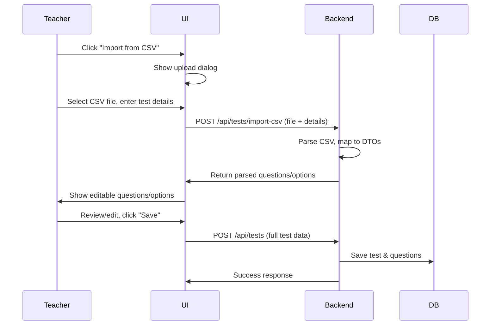

# Import Questions from CSV – Feature Design

## Overview

This document describes the approach to enable teachers to import questions and options from a CSV file when creating a test. The feature allows teachers to upload a CSV, review/edit the parsed questions, and save the test as usual.

---

## 1. Frontend Changes

### a. UI/UX Flow

- On the “Create Test” page, add an “Import from CSV” button next to the “Create Test” button.
- When clicked, redirect to a new page (or open a modal) with:
  - **Basic Test Details**: Test Name, Duration, etc.
  - **Questions Table**: Pre-filled with questions/options parsed from the uploaded CSV.
  - Allow teachers to review/edit questions/options/answers before saving.

### b. CSV Upload

- Add a file input for CSV upload.
- On file selection, send the CSV file to the backend via a new API endpoint (e.g., `/api/tests/import-csv`).
- After parsing, display the parsed questions/options in the UI for review.

---

## 2. Backend Changes

### a. Controller

- Add a new endpoint in `TestController`:
  ```java
  @PostMapping("/import-csv")
  public ResponseEntity<ImportTestResponse> importTestFromCsv(
      @RequestParam("file") MultipartFile file,
      @RequestParam("testName") String testName,
      @RequestParam("duration") int duration
  )
  ```
- This endpoint will:
  - Parse the CSV.
  - Map rows to question/option DTOs.
  - Return a response with the parsed data for frontend review.

### b. Service Layer

- Implement a method in `TestService` to:
  - Parse the CSV (use OpenCSV or similar).
  - Validate the structure (columns: Question_Number, Question, Option_1, ..., Correct_Option).
  - Map each row to a `QuestionDTO` with options and correct answer.
  - Return a DTO containing test details and the list of questions/options.

### c. DTOs

- Create/extend DTOs for:
  - `ImportTestResponse` (test details + list of questions/options).
  - `QuestionDTO` (question text, options, correct answer).

### d. CSV Parsing Utility

- Add a utility class (e.g., `CsvQuestionParser`) to handle CSV parsing and validation.

---

## 3. Frontend: Review & Save

- After receiving the parsed data, display it in the same “Create Test” form (editable).
- On “Save”, submit the full test (with questions/options) to the existing create test API.

---

## 4. Validation & Error Handling

- Validate CSV format and data (e.g., missing fields, duplicate questions).
- Show errors to the user if parsing fails.
- Allow manual correction in the UI before final save.

---

## 5. Security & Permissions

- Ensure only users with the TEACHER role can access the import endpoint.

---

## 6. Testing

- Unit test the CSV parsing logic (valid/invalid files).
- Integration test the import endpoint.
- UI test for the import/review/save flow.

---

## 7. Tech Stack Recommendations

- **Backend CSV Parsing**: Use OpenCSV or Apache Commons CSV.
- **Frontend**: Use a table/grid component for question review/editing.

---

## 8. Sample Flow Diagram



---

## 9. Summary of Steps

1. Add “Import from CSV” button and upload UI.
2. Implement backend endpoint to parse CSV and return questions/options.
3. Display parsed data for review/editing.
4. On save, use existing test creation flow.
5. Add validation, error handling, and tests.

---

This approach keeps your current flow intact, adds a user-friendly import option, and ensures teachers can review and correct imported data before saving.
